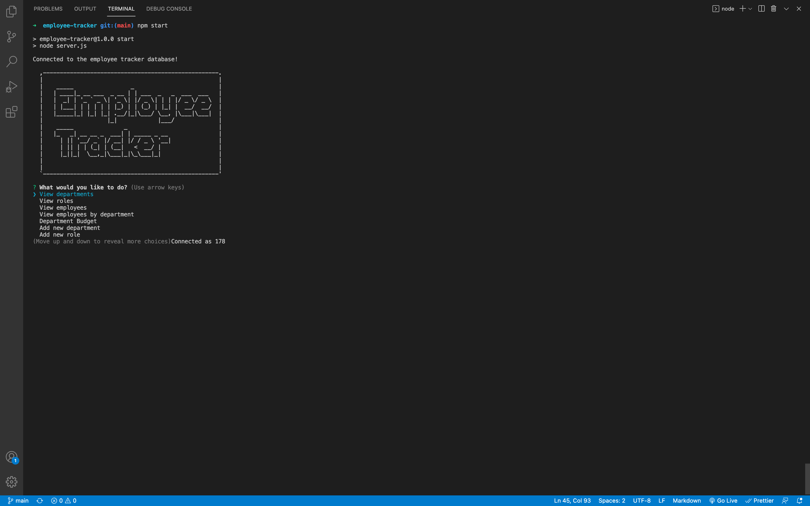
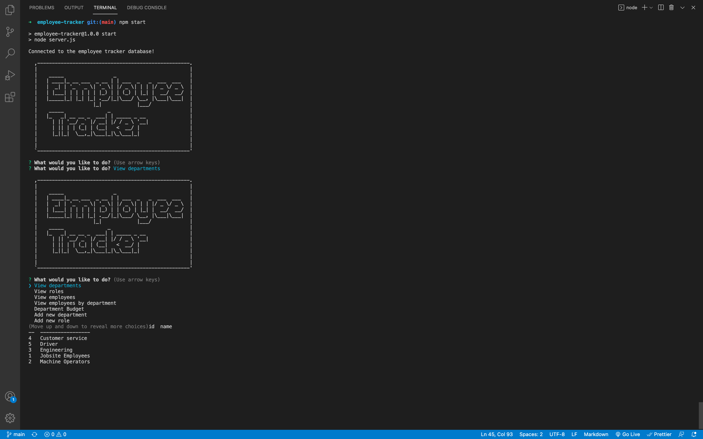
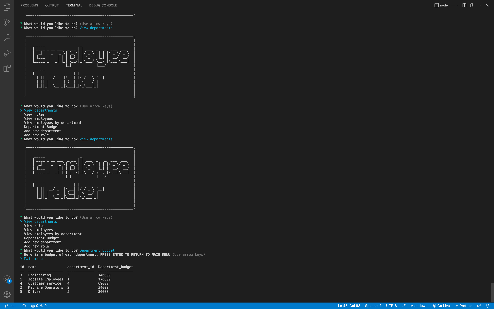

# Employee tracker

  
  
  ## Table of Content
  
  * [Description](#description)
  
  * [Motivation](#motivation)
  
  * [Usage](#usage)
  
  * [Installation](#Installation)
  
  * [Contributors and more](#contributors)
  
  * [Questions](#questions)

  ## Description

  To help employers, managers, supervisors, etc. keep track of their growing business
  
  ## Motivation

  I just wanted to help those that found this useful, work on my database skills, making queries, and much more skills that this project involved!

  ## Usage
  keep track of all aspects of your businees, employees, departments, roles, budgets, and many more coming sooN!

  ## Installation 

  ### Dependencies: node.js , jest , mysql , mysql2 , inquirer
  ### To install: npm i OR npm install mysql2 inquirer
  ### CLI to start: node server.js or npm start

  ## Contributors

  ### People: Myself and friends
  ### GitHub Username: santiagov916
  ### GitHub Link to project: https://github.com/santiagov916/employee-tracker

  ## Questions?

  ### Email the programmer: gme.santi24@yaho.com
  ### Video of the program in action: https://watch.screencastify.com/v/kw2unOn8R11PL1LOkb74
  
  ## Images of program 
  
  
  